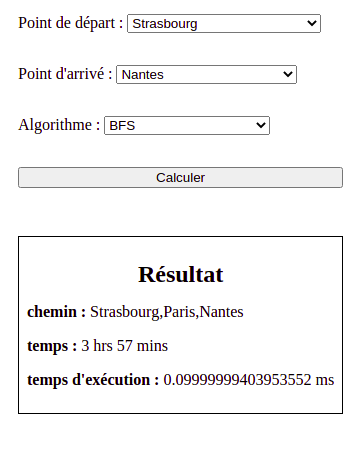
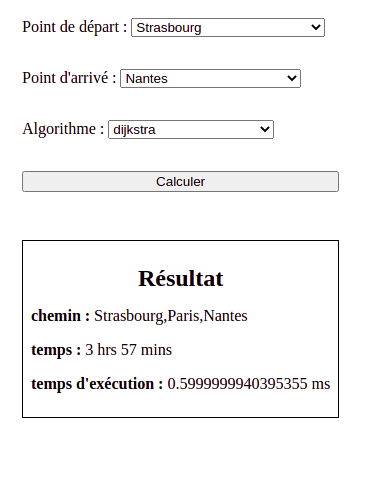
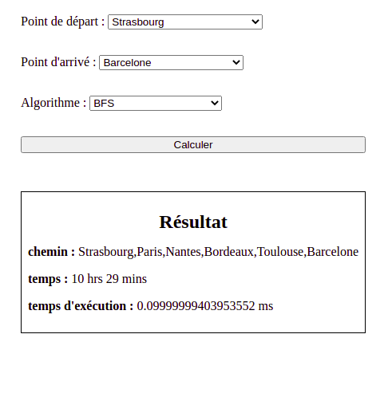
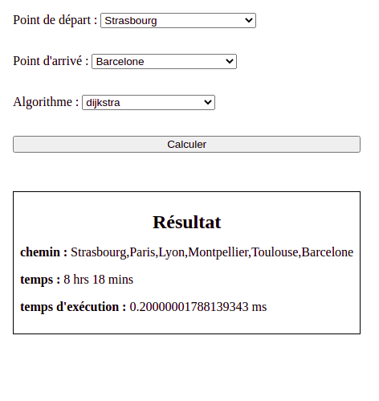

# Projet Path Finding sur réseau ferroviaire

Dans cette application j'ai implémenté un réseau de 12 noeuds représentant plusieurs gare ferroviaire de france. Ce réseau est représenté par un graph non orienté et valué, les valeurs des branches correspondent au temps de trajet en minutes entre deux point(ce temps est convertit en heures dans l'affichage front). 
Le but de l'application est de sélectionné un point de départ, puis un point d'arrivé ainsi que l'algorithme désiré pour le calcul. 
Le résultat obtenu contient l'initinéraire, le temps en heures du trajet, ainsi que le temps d'éxécution de l'algorithme en milliseconde.

## Observation sur les algorithmes

En maniplulant l'application l'on peut observer que globalement l'algorithme de parcours en largeur (BFS) est plus rapide en termes d'exécution que dijktra :

Exemple sur un trajet Strasbourg - Nante : 

||
-

||
-
L'on remarque que les deux algorithmes on trouvé le même itinaire cependant l'algorithme de dijkstra met pratiquement 6 fois plus de temps
d'exécution avec 0.6 milliseconde contre seulement 0.1 milliseconde pour BFS.

Cependant si l'on prend un itinéraire un peu plus complexe comme un Strasbourg - Barcelone : 

||
-
||
-
Ici l'on remarque que BFS reste le plus rapide en termes d'exécution, mais c'est dijkstra qui trouve l'itinéraire le plus rapide.
En effet BFS n'est pas capable de gérer des valeur de branche supérieur à 1, c'est donc dijkstra qui est le plus approprié dans ce genre de cas.

## Conclusion

On peut donc conclure que BFS est plus rapide pour gérer des graphes non valué, mais dijkstra reste supérieur dans le cas de graphes valué 
avec des valeurs > 1, bien que moins rapide dijkstra répond mieux à la problématique du plus court chemin dans notre cas d'application d'itinéraire.

